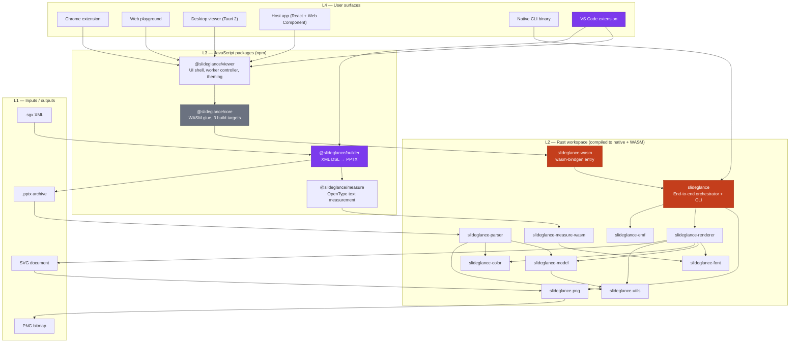
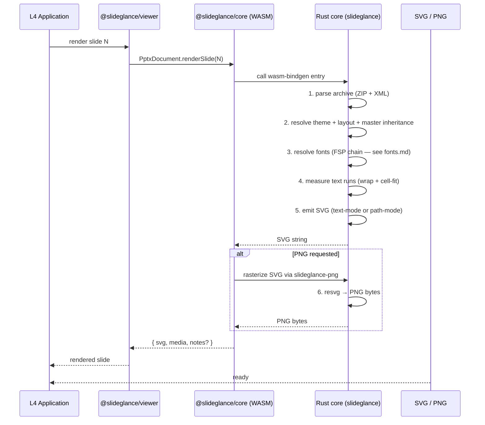
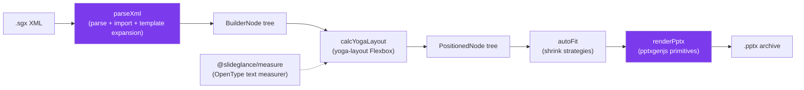
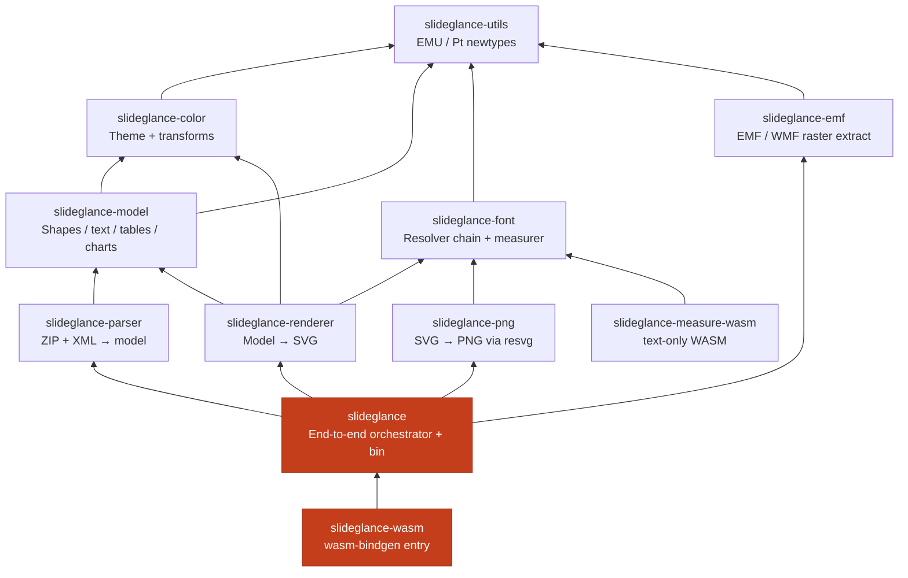
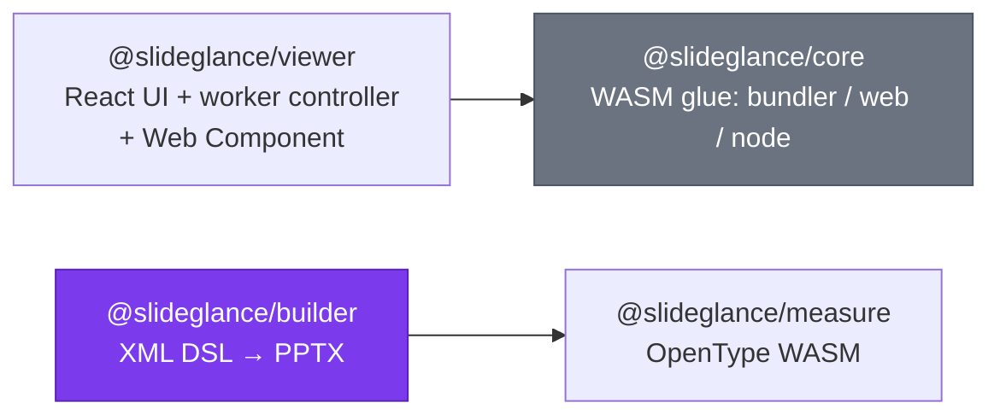
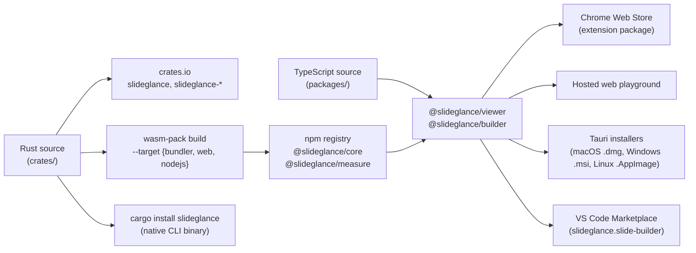
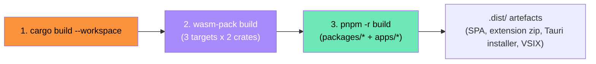

# SlideGlance Architecture

## Table of contents

1. [Layered overview](#layered-overview)
2. [Conversion pipeline (PPTX → SVG / PNG)](#conversion-pipeline-pptx--svg--png)
3. [Authoring pipeline (XML → PPTX)](#authoring-pipeline-xml--pptx)
4. [Component responsibilities](#component-responsibilities)
5. [Distribution surfaces](#distribution-surfaces)
6. [Build pipeline](#build-pipeline)
7. [Determinism guarantees](#determinism-guarantees)
8. [Where to read next](#where-to-read-next)

---

## Layered overview

Four layers across two pipelines. The Chrome extension, web playground,
desktop viewer, and VS Code extension share the same JS layer; the CLI
and WASM bundle share the same Rust core; the slide builder operates
above the rendering pipeline as an authoring layer that emits the
`.pptx` files everything else consumes.

| Layer | Language / runtime              | Responsibility                                                                              |
| ----- | ------------------------------- | ------------------------------------------------------------------------------------------- |
| L1    | I/O                             | The `.sgx` source, the `.pptx` archive, and SVG / PNG output.                              |
| L2    | Rust → native + WebAssembly     | Parsing, layout, font measurement, glyph shaping, SVG emission, PNG rasterization.          |
| L3    | TypeScript / JavaScript         | UI shell, worker, theming, framework adapters, declarative authoring. Does not parse PPTX. |
| L4    | Browser / Tauri / native binary | The user-facing app.                                                                        |

All PPTX semantics live in L2. The JS layer has two roles:

- **Viewing**: a thin shell that drives the WASM core and renders SVG into the DOM (`@slideglance/viewer` + `@slideglance/core`).
- **Authoring**: a declarative XML compiler that emits `.pptx` (`@slideglance/builder` + `@slideglance/measure`).

---

## Conversion pipeline (PPTX → SVG / PNG)

`.pptx` → SVG (and optionally PNG) in six stages.

| Stage | Module                           | What happens                                                                                          |
| ----- | -------------------------------- | ----------------------------------------------------------------------------------------------------- |
| 1     | `slideglance-parser`             | Open ZIP, parse `presentation.xml`, slide XMLs, layouts, masters, theme.                              |
| 2     | `slideglance` (`doc`, `convert`) | Apply text-style inheritance, color-map override, placeholder geometry merging.                       |
| 3     | `slideglance-font`               | Walk the **font source priority** chain: embedded → caller-supplied → bundled → host OS → fallback.   |
| 4     | `slideglance-font` + `-renderer` | Glyph shaping (rustybuzz) + run-level wrap + cell-fit; same face used to measure and to render.       |
| 5     | `slideglance-renderer`           | Emit SVG. Path-mode (`<path>` glyph outlines) when a font resolver is supplied; text-mode otherwise.  |
| 6     | `slideglance-png` (resvg)        | Rasterize SVG to PNG. Requires path-mode SVG so resvg never has to perform host-system font matching. |

---

## Authoring pipeline (XML → PPTX)

`@slideglance/builder` is the inverse of the conversion pipeline — it
takes a declarative XML document and emits an editable `.pptx` file.
Four parse-time / build-time stages.

| Stage          | Module                                                       | What happens                                                                              |
| -------------- | ------------------------------------------------------------ | ----------------------------------------------------------------------------------------- |
| 1. Parse       | `parseXml/` (with `imports`, `templates`, control-flow tags) | XML → typed BuilderNode tree. `<Import>` and `<Use>` expansion happen here.               |
| 2. Layout      | `calcYogaLayout/`                                            | Run yoga-layout to convert flex-style declarations into absolute boxes.                  |
| 3. Auto-fit    | `autoFit/`                                                   | When a slide overflows, apply shrink strategies (rows → fonts → gaps → uniform scale).    |
| 4. Render      | `renderPptx/`                                                | Emit pptxgenjs primitives: shapes, text runs, charts, tables, masters.                    |

Output is a [pptxgenjs](https://gitbrent.github.io/PptxGenJS/) instance
that the caller saves via `writeFile`, `write`, or `stream`.

The VS Code extension (`slideglance.slide-builder`, source under `apps/vscode-extension/`) drives this
pipeline live for `.sgx` previews, then feeds the resulting `.pptx`
bytes into `@slideglance/viewer` for rendering. Click-to-source
navigation works because `buildPptx` runs with `trackSourcePos: true`,
which stamps each rendered pptxgenjs object with `objectName="node#N"`
the webview can map back to source positions.

---

## Component responsibilities

### Rust workspace (L2)

Strict one-way dependency hierarchy. You can pull `slideglance-color`
(or any lower crate) without dragging in the renderer.

| Crate                       | Role                                                                                            |
| --------------------------- | ----------------------------------------------------------------------------------------------- |
| `slideglance-utils`         | Branded units (`Emu`, `Pt`, `HundredthPt`) so unit slips fail at compile time.                  |
| `slideglance-color`         | Theme color resolution (`<a:schemeClr>`, `<a:srgbClr>`) + color transforms (lumMod / tint / …). |
| `slideglance-model`         | Intermediate document model — shapes, text bodies, fills, gradients, tables, charts, themes.    |
| `slideglance-parser`        | ZIP + XML reader. Output: a fully-resolved `Presentation` with slide / layout / master merged.  |
| `slideglance-font`          | Font resolver chain, OpenType-based wrap measurer, CJK script splitting, theme-script fonts.    |
| `slideglance-renderer`      | Model → SVG. Implements text-mode and path-mode emission, fills, effects, warps, tables, charts.|
| `slideglance-emf`           | Detects EMF / WMF raster wraps, extracts the inner BMP / PNG so they can be inlined as images.  |
| `slideglance-png`           | SVG → PNG via resvg. Always runs in path-mode so host-system fonts don't affect output.         |
| `slideglance`               | Public API (`convert_to_svg`, `convert_to_png`, `PptxDocument`) + CLI binary.                   |
| `slideglance-wasm`          | wasm-bindgen entry that re-exports the orchestrator for browser / Node consumers.               |
| `slideglance-measure-wasm`  | Stand-alone text-measurement WASM, ~10× smaller than `slideglance-wasm`. Powers `@slideglance/measure`. |

### JavaScript packages (L3)

- **`@slideglance/core`** — three builds in `packages/core/dist/{bundler,web,node}/`, selected by `package.json` `exports` per environment.
- **`@slideglance/viewer`** — React shell with toolbar, thumbnails, notes, sections, search, theme, print, PDF export. Drives `@slideglance/core` in a Web Worker and pipes SVG back to the main thread. The bundle also registers a `<pptx-viewer>` Web Component for vanilla / non-React hosts.
- **`@slideglance/builder`** — TypeScript library that compiles a small XML DSL into editable `.pptx` files via [pptxgenjs](https://gitbrent.github.io/PptxGenJS/). yoga-layout drives Flexbox positioning; `@slideglance/measure` provides accurate text widths for line-break decisions.
- **`@slideglance/measure`** — Standalone text-measurement WASM. Used internally by `@slideglance/builder` and exposed for upstream layout engines that want to share metrics with the SlideGlance renderer.

### Apps (L4)

| App                | Role                                                                                                         |
| ------------------ | ------------------------------------------------------------------------------------------------------------ |
| `chrome-extension` | Service worker intercepts `.pptx` URLs and redirects to a viewer tab; right-click menu.                      |
| `web-playground`   | Vite SPA — drop a `.pptx` to render. Used for fixtures and demos.                                            |
| `desktop-viewer`   | Tauri 2 shell + `pptx://` URI, native menubar, drag-drop, recent files.                                      |
| `vscode-extension` | Live preview for `.sgx` files (driven by `@slideglance/builder` + `@slideglance/viewer`) plus `.pptx` viewer. |
| `landing`          | Static GitHub Pages site that hosts the playground iframe.                                                   |

---

## Distribution surfaces

The same Rust core ships through five channels; the authoring side
ships through two more.

Deterministic SVG, MIT, no telemetry — uniform across every channel.

---

## Build pipeline

Three sequential stages. Each consuming package's `prebuild` hook runs
the wasm build, short-circuiting when `crates/` is unchanged.

| Stage | Driver                              | Output                                                                                                 |
| ----- | ----------------------------------- | ------------------------------------------------------------------------------------------------------ |
| 1     | `cargo build --workspace`           | Native libraries + the CLI binary in `target/{debug,release}/`.                                        |
| 2     | `scripts/build-wasm.sh` (wasm-pack) | `packages/{core,measure}/dist/{bundler,web,node}/` — wasm + JS glue.                                   |
| 3     | `pnpm -r build`                     | Each JS package's `dist/`, the playground bundle, the extension zip, the Tauri app, the VS Code VSIX.  |

The wasm script uses mtime-based caching — exits under 100 ms when up
to date. Set `FORCE=1` to override.

---

## Determinism guarantees

- **SVG deterministic** — same input + same options → byte-identical SVG.
- **PNG deterministic** — given the same font set. VRT relies on this to catch render drift.
- **Builder PPTX deterministic** — same XML + same options + same builder version → the same archive (modulo timestamps inside the ZIP, which pptxgenjs sets to a fixed epoch).
- **No system clock** — `datetime{N}` placeholders stay literal unless the caller supplies a `Timestamp`.
- **No randomness** in render paths — `BTreeMap` / sorted keys lock iteration order.
- **No `unsafe`** at workspace level (`unsafe_code = "forbid"`).

---

## Where to read next

- [Fonts](./fonts.md) — font pipeline reference.
- [`packages/builder/`](../../packages/builder/docs/en/index.md) — slide builder overview.
- [`packages/builder/docs/en/`](../../packages/builder/docs/en/index.md) — builder deep-dives.
- [`packages/viewer/`](../../packages/viewer/docs/en/index.md) — viewer component API.
- [`apps/chrome-extension/`](../../apps/chrome-extension/docs/en/index.md) — Chrome extension entry flows.
- [`apps/vscode-extension/`](../../apps/vscode-extension/docs/en/index.md) — VS Code extension overview.
