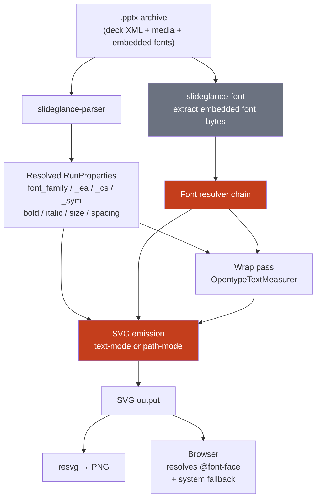
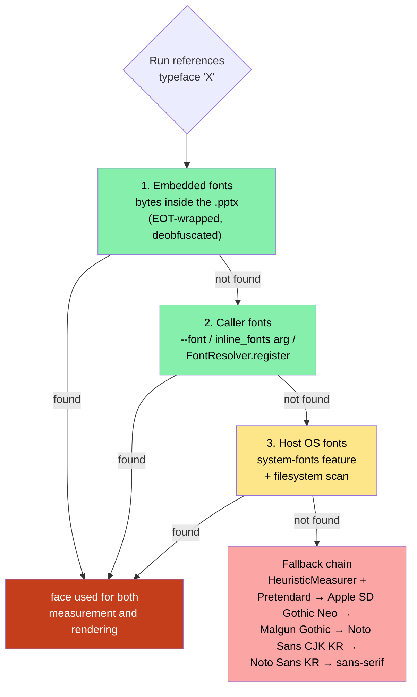
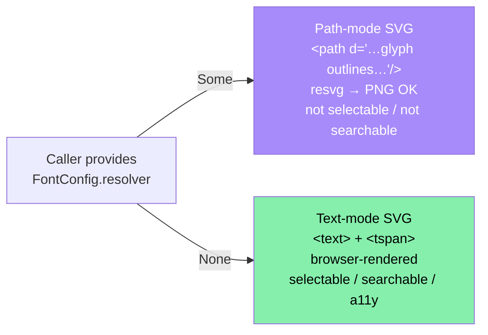
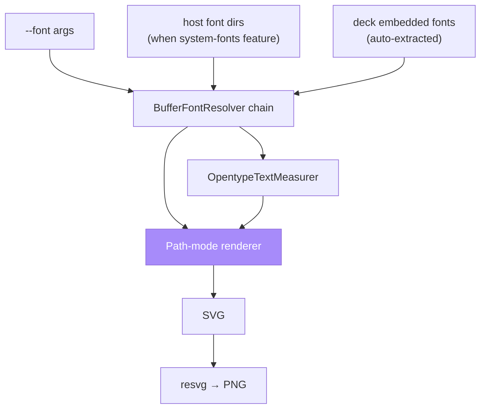
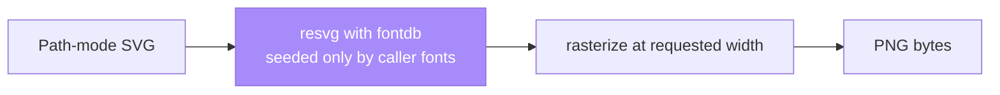
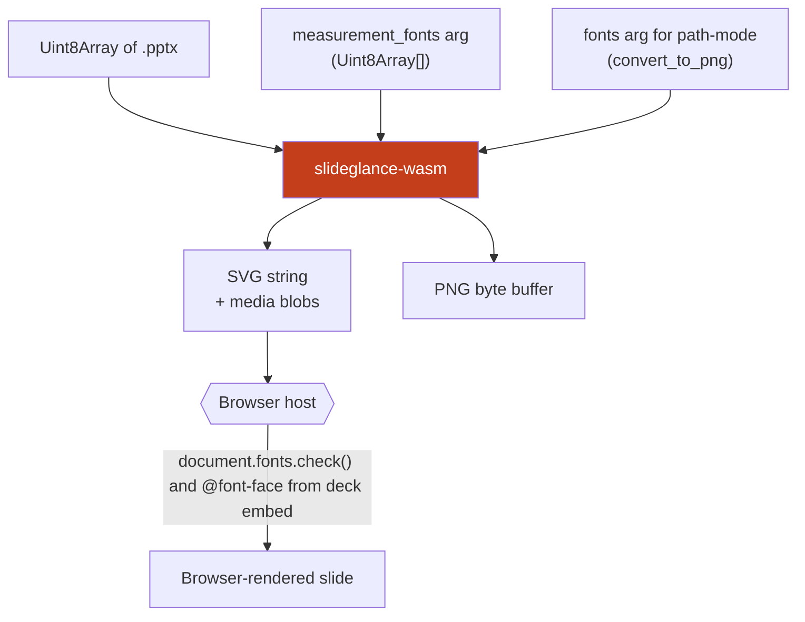
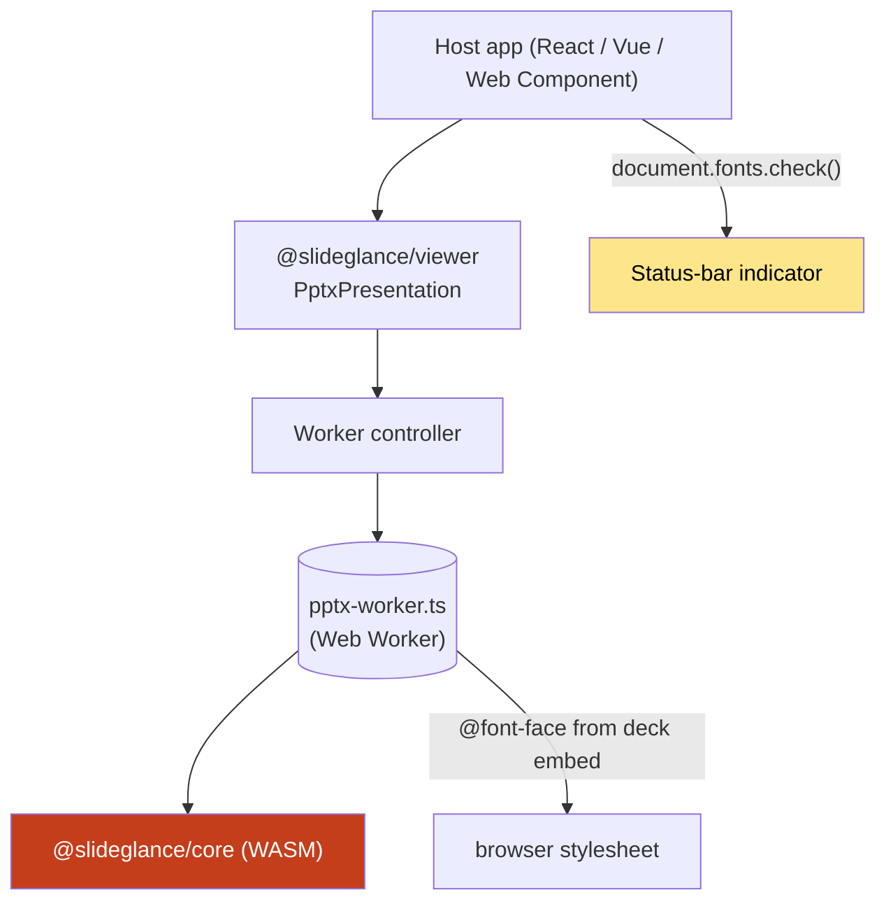
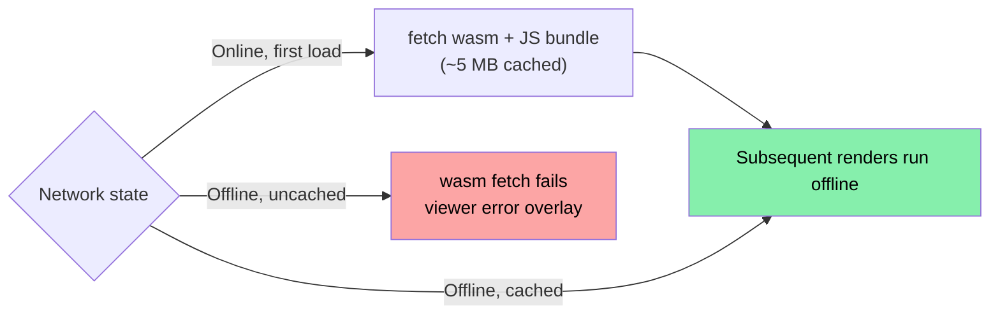

# Fonts in SlideGlance — Environment Reference

This document covers the **conversion-side** font pipeline (PPTX → SVG
/ PNG). For the authoring side — how `@slideglance/builder` measures
text widths to drive line-break decisions before PPTX is generated —
see [`packages/builder/docs/text-measurement.md`](../../packages/builder/docs/en/text-measurement.md).

Environments covered:

1. **Native CLI** — `slideglance convert / render`
2. **Native Rust library** — `slideglance::convert_to_svg / convert_to_png`
3. **Native PNG rasterizer** — resvg backend shared by the two above
4. **wasm bundle** — `@slideglance/core` for browsers and Node
5. **Embeddable viewer** — `@slideglance/viewer`, used by the Chrome
   extension, web playground, desktop app, and VS Code extension preview

## Table of contents

1. [Pipeline overview](#1--pipeline-overview)
2. [Font source priority (FSP)](#2--font-source-priority-fsp)
3. [Output modes — path vs. text](#3--output-modes--path-vs-text)
4. [Per-environment behavior](#4--per-environment-behavior)
5. [OS differences](#5--os-differences)
6. [Browser differences](#6--browser-differences)
7. [Online vs. offline](#7--online-vs-offline)
8. [Failure modes and what you'll see](#8--failure-modes-and-what-youll-see)
9. [Cargo features reference](#9--cargo-features-reference)
10. [Quick decision tables](#10--quick-decision-tables)

---

## 1 · Pipeline overview



Two dispatch points:

- **Measurer selection** at parse time — how wrap computes line widths.
- **Resolver presence** at render time — `<text>` (text-mode) vs `<path>`
  glyph outlines (path-mode).

Invariant: **the face used to measure a run is the face used to render
it.** Otherwise wrap positions diverge from what the reader sees.

---

## 2 · Font source priority (FSP)

Three sources, searched in order. **First match wins.**



| Source | Always available?               | Notes                                                                     |
| ------ | ------------------------------- | ------------------------------------------------------------------------- |
| 1 — Embedded   | Always (when the deck includes them) | Auto-extracted from `<p:embeddedFontLst>`. EOT wrappers are stripped; subset-only embeds still cover every glyph the deck actually uses. |
| 2 — Caller     | Always                              | The integrator's hook for guaranteeing fonts are present.                |
| 3 — Host OS    | Opt-in (`system-fonts` Cargo feature) + non-empty filesystem | Scans `~/Library/Fonts`, `/System/Library/Fonts`, `~/.fonts`, etc. **No-op in the WASM bundle** — there is no filesystem. |
| Fallback chain | Always                              | Heuristic measurement + a CSS font-family list ending in `sans-serif`. Set in the SVG `<text>` attribute so the browser can still render *something*. |

The matched source is observable via the viewer's status-bar
**font-fallback indicator**, which surfaces typefaces that resolved to a
different face.

---

## 3 · Output modes — path vs. text

The branch depends on whether the caller supplies a font resolver.



| Aspect                          | Path-mode                       | Text-mode                            |
| ------------------------------- | ------------------------------- | ------------------------------------ |
| Element type                    | `<path>` per glyph              | `<text>` + `<tspan>`                 |
| Selectable in viewer            | ✖                               | ✔                                    |
| Searchable / accessible         | ✖                               | ✔                                    |
| Pixel-stable across viewers     | ✔                               | ⚠ depends on browser font matching   |
| PNG rasterization (resvg)       | ✔                               | ✖ resvg can't system-fallback        |
| File size                       | larger (one path per glyph)     | smaller                              |
| Required input                  | font resolver with bytes        | none                                 |

**No glyph stretching** — no `textLength` / `lengthAdjust`. PowerPoint
doesn't do it either. Cell overflow stays as overflow.

---

## 4 · Per-environment behavior

### 4.1 · Native CLI



- Canonical input: `slideglance convert / render --font path1.ttf --font path2.otf`.
- `system-fonts` Cargo feature scans the OS — fine for development; pin
  fonts via `--font` for reproducible output.
- CLI renders are always path-mode (required by `convert_to_png`,
  beneficial for SVG determinism).

### 4.2 · Native Rust library

Same pipeline, driven programmatically.

```rust
use slideglance::{convert_to_svg, convert_to_png, ConvertOptions, FontConfig, AdditionalFont};

let bytes = std::fs::read("deck.pptx")?;
let opts = ConvertOptions {
    fonts: FontConfig {
        inline_fonts: vec![
            AdditionalFont::regular("Pretendard",
                std::fs::read("Pretendard-Regular.otf")?),
            AdditionalFont::bold("Pretendard",
                std::fs::read("Pretendard-Bold.otf")?),
        ],
        ..FontConfig::default()
    },
    ..ConvertOptions::default()
};
let pngs = convert_to_png(bytes, &opts)?;
```

`FontConfig.resolver` is the path-mode toggle — set it to `Some(resolver)`
to embed glyph outlines. `FontConfig.inline_fonts` populates the same
`BufferFontResolver` automatically.

### 4.3 · Native PNG rasterizer

`slideglance-png` wraps resvg with deterministic options.



- **Text-mode SVG can't be rasterized here** — resvg deliberately has no
  host font fallback. Text-mode glyphs render as empty boxes.
- fontdb is seeded *only* from `inline_fonts` / `--font` — the rasterizer
  never reads `~/Library/Fonts` even when `system-fonts` is enabled at
  the parser. PNG output must be reproducible across machines.

### 4.4 · wasm bundle (`@slideglance/core`)

Three builds in `packages/core/dist/{bundler,web,node}/`. Node and
browser runtime behavior are identical.



- **Source 4 (host OS) is a no-op** — wasm sandbox has no filesystem.
- Sources 1, 2, 3 work identically to native — pass embedded font bytes
  via `measurement_fonts`, or path-mode fonts via
  `convert_to_png(fonts: Uint8Array[])`.
- Output is text-mode by default; `convertPptxToPng` switches to
  path-mode (font set required).

### 4.5 · Embeddable viewer (`@slideglance/viewer`)

React shell on top of `@slideglance/core` with a WASM-hosting Web Worker.



- **Worker isolation** — main thread stays responsive on multi-hundred
  slide decks.
- **Embedded fonts → `@font-face`** — worker extracts bytes from
  `<p:embeddedFontLst>`, base64-encodes them into a single CSS rule
  mounted once. All subsequent `<text>` elements use them automatically.
- **Font-fallback indicator** — probes `document.fonts.check()` against
  the SVG font-family chain. Only mismatches are listed; a fully-matched
  deck shows nothing.
- **Canvas measurer** (`useCanvasMeasurer: true`) — routes wrap measurements
  through `OffscreenCanvas.measureText` using the same font-family chain
  the browser will render with. Eliminates wrap drift.

---

## 5 · OS differences

| OS       | Default CJK fallbacks (auto-injected for CJK runs)                          | `system-fonts` scan paths                                                |
| -------- | --------------------------------------------------------------------------- | ------------------------------------------------------------------------ |
| macOS    | Apple SD Gothic Neo (Korean), Hiragino Sans (Japanese), PingFang SC (Chinese) | `~/Library/Fonts`, `/Library/Fonts`, `/System/Library/Fonts`, `/System/Library/Fonts/Supplemental` |
| Windows  | Malgun Gothic (Korean), Yu Gothic (Japanese), Microsoft YaHei (Chinese)     | `C:\Windows\Fonts`, `%LOCALAPPDATA%\Microsoft\Windows\Fonts`             |
| Linux    | Noto Sans CJK (varies by distro)                                            | `~/.fonts`, `~/.local/share/fonts`, `/usr/share/fonts`, `/usr/local/share/fonts` |

The CJK fallback chain is baked into the SVG, so the same output
renders correctly on any OS that has *any* CJK font installed.

---

## 6 · Browser differences

| Browser           | Behavior                                                                                                             |
| ----------------- | -------------------------------------------------------------------------------------------------------------------- |
| Chromium / Edge   | Best-supported. `document.fonts.check()` is reliable; OffscreenCanvas measurement matches render exactly.            |
| Firefox           | Same family-detection guarantees. WOFF2 deck embeds load slightly faster than Chromium due to different parser.     |
| Safari            | `font-size-adjust` prior to 16.4 is unsupported — vertical metric correction falls back to direct font-size scaling. |
| WebView (Tauri)   | Inherits the platform's WebKit / WebView2 behavior. The desktop app's media protocol bypasses `Blob` URL revocation. |

Embedded font data URIs work the same in all four — Sharp / resvg /
browsers all accept the base64-encoded TTF/OTF the viewer emits.

---

## 7 · Online vs. offline



- **First load is the only network access** — once the wasm bundle is
  cached, subsequent renders need zero network.
- **No CDN font fetching** — bundled fonts (source 3) ship in the binary,
  embedded fonts (source 1) in the `.pptx`, caller fonts (source 2) in
  the host bundle.
- **Chrome extension is offline by default** — wasm and fonts are bundled
  into the extension package.

---

## 8 · Failure modes and what you'll see

| Symptom                                                                  | Cause                                                                                | Fix                                                                                              |
| ------------------------------------------------------------------------ | ------------------------------------------------------------------------------------ | ------------------------------------------------------------------------------------------------ |
| Korean / CJK text renders as boxes (□□□) in **CLI PNG output**           | Source 4 disabled, no `--font` for the CJK face                                      | Add `--font /path/to/AppleSDGothicNeo.ttc` (repeat per face).                                    |
| Korean / CJK text renders as Latin replacement chars in **wasm PNG**     | `convertPptxToPng` called with empty `fonts`                                         | Pass deck font buffers via the `fonts` argument, or render to SVG and let the browser handle it. |
| Status bar warns "맑은 고딕 → Noto Sans KR"                                | The deck's CJK font isn't installed on the user's machine                            | Install the original font or accept the substitute.                                              |
| Wrap positions differ between SVG and browser render                     | Measurement face ≠ render face                                                       | Set `useCanvasMeasurer: true` on the worker, or pin the measurement font set via the constructor. |
| Console: `Failed to decode downloaded font: data:font/ttf;base64,...`   | EOT-wrapped embedded font wasn't unwrapped                                            | Update SlideGlance — this was fixed by the EOT-strip extractor.                                  |
| Browser font-size-adjust gives unexpected vertical alignment              | Safari < 16.4                                                                        | The font-size scaling fallback handles this automatically; no action needed.                    |
| Tauri desktop app opens a slide as a blank panel                         | The `pptx://` protocol handler isn't registered                                       | Ensure `tauri.conf.json` includes the protocol entry; restart the dev server.                   |

---

## 9 · Cargo features reference

| Feature                | Default | Adds                                                                                            |
| ---------------------- | ------- | ----------------------------------------------------------------------------------------------- |
| `system-fonts`         | off     | Source 3 (host filesystem font scan). Native only — wasm targets ignore this feature.           |
| `metric-match`         | off     | PANOSE + OS/2 best-match catalogue (80+ Latin fonts). Improves font-family chain quality.       |

The published wasm bundle (`@slideglance/core`) enables `metric-match`.
Custom builds can disable it to shrink the binary.

---

## 10 · Quick decision tables

### What input do I need to provide for fonts?

| Goal                                                  | Input needed                                                                |
| ----------------------------------------------------- | --------------------------------------------------------------------------- |
| Browser viewer, deck has embedded fonts               | Nothing — sources 1+5 cover every glyph.                                    |
| Browser viewer, no embedded fonts, CJK deck           | Nothing if user has CJK fonts installed; otherwise add bundled fonts.       |
| Server-side SVG conversion                            | `inline_fonts` for any face the deck might reference.                       |
| Server-side PNG conversion                            | **Mandatory** `inline_fonts` covering every visible glyph. resvg has no fallback. |
| Pixel-stable bit-equal output across machines         | Same `inline_fonts` set on every run, no `system-fonts` feature.            |

### What's the right output mode?

| Need                                                  | Mode                                                                       |
| ----------------------------------------------------- | -------------------------------------------------------------------------- |
| Selectable / searchable text                          | Text-mode (default in the wasm bundle and the viewer).                     |
| Identical pixels on every viewer                      | Path-mode SVG.                                                             |
| Rasterize to PNG                                       | Path-mode SVG, then `slideglance-png` (or `convertPptxToPng` directly).    |
| Print to physical paper                                | Path-mode SVG → PDF via the viewer's PDF export button.                    |

---

## Where to read next

- [Architecture](./architecture.md) — high-level component diagram and pipeline overview.
- [`@slideglance/builder` — Text Measurement](../../packages/builder/docs/en/text-measurement.md) — authoring-side text measurement (XML → PPTX).
- [`@slideglance/viewer`](../../packages/viewer/docs/en/index.md) — viewer component API.

---

When this document drifts from reality, the truth lives in
`crates/slideglance-font/` and `packages/viewer/src/pptx-worker.ts`.
Open an issue with a reproducing deck.
